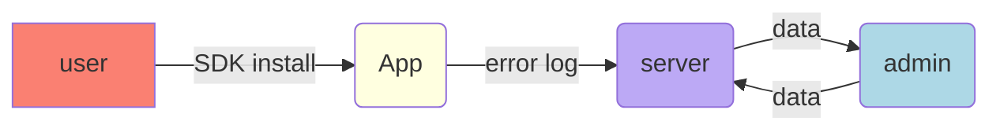

# Project11-C-Web-FE-Performance-Monitoring-Server

## 팀원

- J019 [권오민](https://github.com/ohmink)
- J101 [신동민](https://github.com/NukeStorm)
- J127 [유현우](https://github.com/puba5)
- J213 [하지수](https://github.com/JeesooHaa)

## 프로젝트 소개

> Sentry Like and Simple Project

### 개발 환경

### WiKi

[Wiki Link](https://github.com/boostcamp-2020/Project11-C-Web-FE-Performance-Monitoring-Server/wiki)

### 작업 진행 상황

### 흐름

